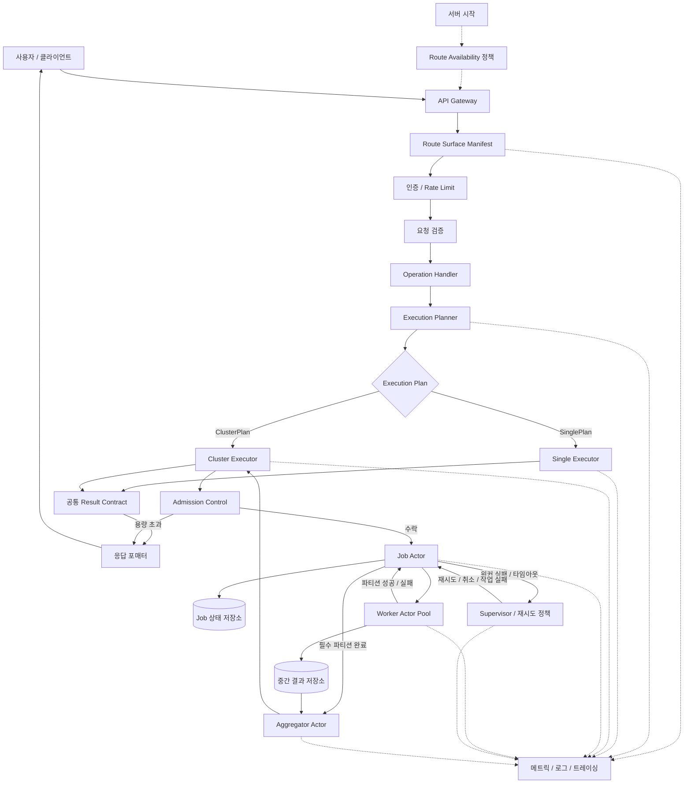
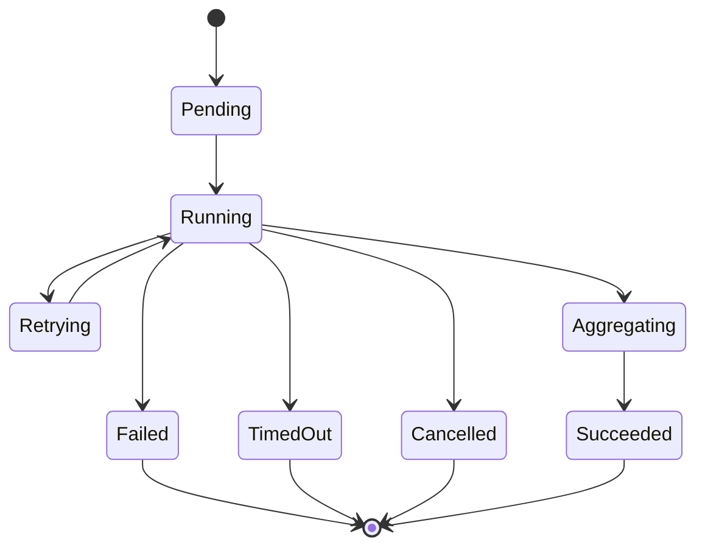

# 요청 Single/Cluster 실행 전략 흐름

이 문서는 사용자 요청을 하나의 `Operation` contract로 정규화한 뒤,
`single` 또는 `cluster` 실행 전략으로 처리하는 제안 흐름을 설명한다.
actor pattern은 모든 요청 path가 아니라 cluster executor 내부의 상태 소유와
실패 처리에 집중 적용한다.

## 라우팅 기준

- `single`은 분산 조정이 필요 없는 작고 동기적인 단순 요청에 사용한다.
- `cluster`는 worker fan-out과 결과 집계가 이득인 long-running, 병렬,
  배치성 요청에 사용한다.
- route/auth/validation/result formatting은 single/cluster로 분기하지
  않는다. 분기는 `ExecutionPlan` 이후 executor strategy에서만 발생한다.

## 경계

- `Route Surface Manifest`는 요청 실행 전에 HTTP path를 S3, ops, admin,
  Iceberg, UI surface로 분류한다.
- `Route Availability Policy`는 선택적 subsystem이 없을 때 feature 기반
  route를 숨길지, 등록하되 unavailable 응답을 줄지 route 등록 시점에
  결정한다.
- `Operation Handler`는 handler 입력을 사용자-facing 의미의 `Operation`으로
  정규화한다.
- `Execution Planner`는 같은 operation에 대해 `SinglePlan` 또는
  `ClusterPlan`을 선택한다.
- `SingleExecutor`는 actor hop 없이 직접 실행해 hot path를 보호한다.
- `ClusterExecutor`는 actor 기반 orchestration을 담당한다.
- `JobActor`는 cluster job 상태, fan-out, fan-in, 취소, 타임아웃 처리를
  소유한다.
- `WorkerActor` pool은 partition 단위 작업을 bounded concurrency로 처리한다.
- `Supervisor`는 retry, backoff, cancellation, failure policy를 적용한다.
- `AggregatorActor`는 worker 중간 결과를 공통 result contract로 병합한다.

## 처리 흐름

1. 클라이언트가 API gateway로 요청을 보낸다.
2. `Route Surface Manifest`가 path를 분류하고 인증 정책을 선택한다.
3. 요청은 인증, rate limit, 검증을 통과한다.
4. `Operation Handler`가 요청을 공통 `Operation`으로 정규화한다.
5. `Execution Planner`가 `SinglePlan` 또는 `ClusterPlan`을 만든다.
6. `SinglePlan`은 `SingleExecutor`가 직접 실행한다.
7. `ClusterPlan`은 `ClusterExecutor`가 admission control을 먼저 적용한다.
8. 수락된 cluster job은 `JobActor`가 lifecycle을 소유한다.
9. `JobActor`가 worker pool로 partition 작업을 fan-out한다.
10. worker들은 partition 성공 또는 실패를 `JobActor`에 보고한다.
11. `Supervisor`는 재시도, 타임아웃, 취소, job 실패 정책을 처리한다.
12. 필수 partition이 완료되면 `AggregatorActor`가 중간 결과를 병합한다.
13. single/cluster 결과는 같은 `Result` contract로 응답 포매터에 전달된다.

## Job 상태

## 핵심 정책

- single/cluster는 별도 product path가 아니라 같은 operation의 executor
  strategy다.
- cluster job을 시작하기 전에 idempotency key 또는 request digest를 사용한다.
- route-surface 분류는 actor layer 밖에 둔다. 그래야 S3, ops, admin,
  Iceberg, UI 인증 정책이 결정적이고 테스트 가능하게 유지된다.
- 선택적 subsystem의 노출 여부는 handler 곳곳의 nil check가 아니라 route
  availability manifest에 둔다.
- cluster 작업을 queue에 넣기 전에 admission control을 적용한다.
- cluster 응답 정책을 명확히 한다. 짧은 작업은 즉시 결과를 반환하고, 긴
  작업은 `202 Accepted`와 기존 operation-specific status 조회를 사용한다.
- worker retry는 partition 단위로 제한하고, 전체 job 실패 정책은
  `JobActor`와 `Supervisor`가 소유한다.
- routing decision, queue depth, job duration, retry count, timeout count,
  worker failure rate, aggregation failure rate를 추적한다.
