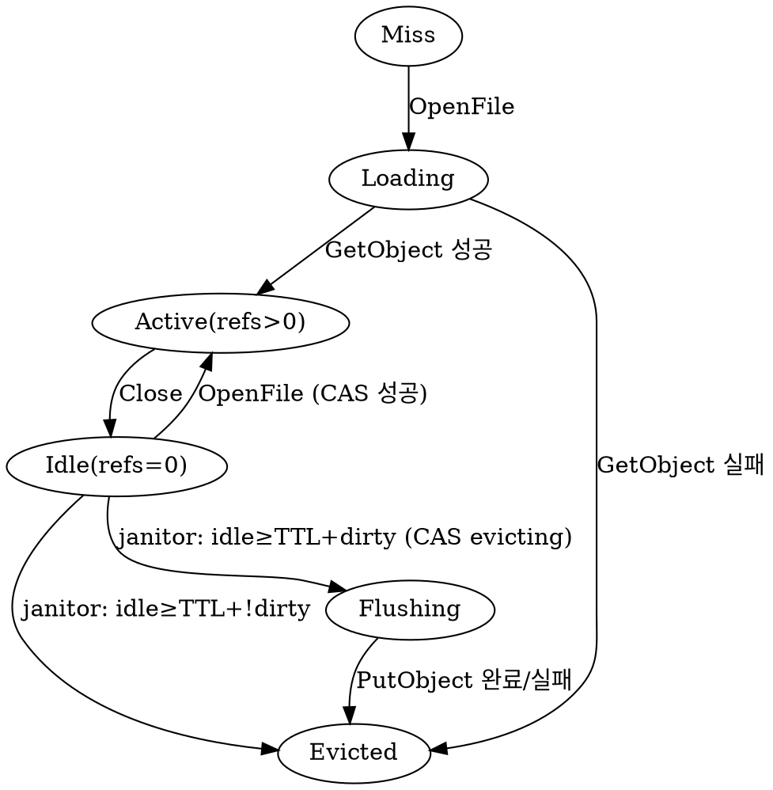

# VFS Write Amplification — Design

- **Date**: 2026-04-28
- **Branch**: bench/grainfs-vs-minio
- **Status**: Draft → revised after eng review (2026-04-28)
- **Related**: NFS vs Ganesha 벤치마크 (Phase 19+)
- **Eng review**: 2026-04-28 — 결정사항 11건 (Task #15–#26 참조). 주요 변경: cache layer GrainVFS → nfsserver, Phase 분리(A 단독 → B 후속), go-nfs fork 필요, lock-free temp+rename, cache memory cap, COMMIT 처리.

## 1. Background

### 1.1 관찰된 현상

`bench_nfs_baseline.sh`로 NFSv3 grainfs-single 워크로드를 실행하면, `dd if=/dev/zero of=/mnt/g/test2.dat bs=1M count=200`이 200MB의 사용자 데이터를 쓰는데도 grainfs 백엔드 디렉토리는 **약 17GB**를 점유한다. 1GiB volume에서는 ENOSPC가 즉시 발생해 fio sweep 자체가 중단된다.

### 1.2 원인 분석

NFSv3는 stateless 프로토콜이다. go-nfs 라이브러리는 매 `WRITE` RPC마다 billy.Filesystem 인터페이스에 대해 `OpenFile → Write → Close` 시퀀스를 호출한다.

`internal/vfs/vfs.go:613-642`의 `grainFile.Close()`는 `f.fs.backend.PutObject(bucket, path, buf)`를 호출하여 buf 전체를 storage 백엔드에 기록한다. `dd bs=1M count=200`은 200번의 NFS WRITE RPC를 발생시키므로:

1. 매 RPC마다 `loadExisting()`이 backend.GetObject로 누적된 파일 전체를 읽어 buf에 적재
2. 1MB append
3. Close가 buf 전체를 PutObject로 다시 기록

`internal/cluster/backend.go:542-545`에 따라:

> "Versioning is unconditional: every PUT gets a fresh ULID so prior versions remain addressable. Bucket-level versioning-state gating is a later slice."

따라서 매 PutObject가 새 versionID를 사용해 `{root}/data/{bucket}/{key}/.v/{ulid}/` 디렉토리에 저장된다. 200번의 PutObject 누적 디스크 사용량은 1+2+…+200 = 20,100MB이며, EC/replication overhead와 metadata 누적까지 포함하면 관찰된 17GB와 일치한다.

Read amplification도 동시 발생한다 (1+2+…+199 = 19,900MB).

### 1.3 영향

- NFS 워크로드 디스크 사용량이 사용자 데이터의 ~100배까지 폭증
- volume 용량을 빠르게 소진해 정상 워크로드 측정 불가
- ganesha 대비 NFS 성능 측정 자체가 진행 불가
- Close 시 PutObject가 직렬화되어 throughput 제한 (단순 latency 합산)

## 2. Goals

1. NFSv3 워크로드의 디스크 사용량을 사용자 데이터 대비 < 1.25배로 억제
2. Read amplification 동시 해소: 동일 path의 연속 OpenFile이 GetObject 반복하지 않음
3. NFS UNSTABLE write semantics 위반 없음 (eviction flush 실패 시 손실 허용 범위 명시)
4. 기존 동기적 write 사용처(S3, NBD, VFS direct API) 행동 변화 없음

## 3. Non-Goals

- NFSv4의 stateful OPEN/CLOSE 활용 (별도 작업)
- NFS COMMIT 프로시저 처리 변경
- bucket-level versioning state gating (S3 일반 bucket 대상의 versioning 정책)
- WAL 기반 dirty buffer durability (현재 범위 밖)
- 다른 client 간 cross-protocol coherency 강화 (이미 구현된 ESTALE 메커니즘 유지)

## 4. Approach

A(backend versioning skip) + B(VFS file handle cache) 이중 안전망.

### 4.1 Approach A — backend versioning skip for VFS internal buckets

`__grainfs_vfs_*` prefix를 가진 bucket은 VFS layer가 단독 소유한다. S3 versioning 의미가 없으므로 fixed versionID를 사용해 in-place overwrite한다.

**변경**:
- `internal/cluster/backend.go`의 `PutObject`가 bucket prefix 검사 후 `vfsVersionID = "current"` 사용
- `putObjectNx`/`putObjectEC`가 동일 path에 overwrite를 허용하도록 보장 (현재도 `os.WriteFile`은 overwrite 가능; 메타데이터 propose 경로만 추가 검증)

**효과**:
- Cache가 실패하거나 우회된 경로(예: VFS direct API)에서도 versioning 누적 방지
- VFS bucket에서 `ListObjectVersions`는 항상 1개 version만 반환 (의도된 동작)

### 4.2 Approach B — VFS file handle cache

GrainVFS에 path keyed cache 추가. 동일 path에 대한 연속 OpenFile/Write/Close가 in-memory buffer만 갱신하고, idle TTL이 만료되면 단일 PutObject로 flush한다.

**자료구조**:

```go
// internal/vfs/file_cache.go
type fileCache struct {
    entries  sync.Map // path → *cachedEntry
    idleTTL  time.Duration  // default 5s
    backend  storage.Backend
    bucket   string
    stop     chan struct{}
    janitor  sync.WaitGroup
}

type cachedEntry struct {
    path     string
    bucket   string
    buf      *bytes.Buffer  // entry.mu가 보호. nil 가능 (eviction in progress)
    refs     atomic.Int32   // 활성 grainFile 개수 + janitor가 evict 진행 중이면 sentinel
    dirty    atomic.Bool
    lastUsed atomic.Int64   // unix nano
    flag     int            // 마지막 OpenFile flag (RDONLY/RDWR 구분용)
    mu       sync.Mutex     // buf 동시성 보호 (NFS 동일 path 동시 접근은 드물지만 safety)
    evicting atomic.Bool    // janitor가 flush 시작 시 true; OpenFile은 false→true CAS 시 cache miss로 처리
}
```

**Lifecycle**:



**Flow**:

- **OpenFile(write flag)**:
  1. `cache.entries.Load(path)` → entry 있으면:
     - `entry.evicting.Load() == true`면 cache miss로 처리 (janitor가 진행 중)
     - 아니면 `entry.refs.Add(1)` → 같은 buf 재사용; lastUsed 갱신; grainFile 반환
  2. miss이면: `backend.GetObject(path)` → 새 entry 생성 → `cache.entries.LoadOrStore`. 다른 goroutine이 먼저 store했으면 그쪽 entry 사용 (refs++)

- **Write(p)**: `entry.mu.Lock(); entry.buf.Write(p); entry.dirty.Store(true); entry.mu.Unlock(); entry.lastUsed.Store(now)`

- **Close**: `entry.refs.Add(-1); entry.lastUsed.Store(now)`. PutObject 호출하지 않음. dirty 데이터는 janitor가 처리.

- **Janitor (1s tick)**:
  1. `cache.entries.Range`로 모든 entry 순회
  2. `refs == 0 && now - lastUsed >= idleTTL`인 entry 후보:
     - dirty이면 `evicting.CompareAndSwap(false, true)` 시도 → 성공 시 PutObject 호출
     - !dirty이면 그냥 `cache.entries.Delete`
  3. PutObject 결과:
     - 성공: `cache.entries.Delete`; `invalidateStatCache`/`invalidateParentDirCache`
     - 실패: `log.Warn`; `cache.entries.Delete` (다음 OpenFile이 디스크 latest 표시 — 손실 허용)

- **Stat (cache hit)**: GrainVFS.Stat이 cache에 entry 있고 dirty이면 buf size를 in-memory truth로 반환. miss이거나 !dirty면 backend HeadObject 사용. NFS GETATTR가 매 RPC sequence 시작에 호출되므로 사용자 가시 size 정합 보장. (NB: Backend.HeadObject 직접 호출자는 cache를 보지 않음 — VFS bucket을 backend 직접 호출하는 경로는 없으므로 영향 없음.)

- **OpenFile read-only**: cache 경로 미사용. 단, 같은 path가 dirty cache entry를 가지면 stale read 위험 → cache hit 시 buf 내용을 io.Reader로 wrapping해 grainFile.rc 대신 메모리 reader 사용. 참조 종료 시 entry.refs--.

- **Rename/Delete**: cache.evict(path) 호출. dirty이면 폐기 (rename이면 새 path로 옮긴 뒤 dirty 유지하는 변형도 가능하지만 첫 슬라이스에서는 단순 폐기).

- **Shutdown**: GrainVFS.Close() (또는 nfsserver Close)가 janitor를 stop하고 dirty entry 전부 동기적으로 flush. graceful timeout 5s.

### 4.3 동시성 보장

- 동일 path 동시 OpenFile: `sync.Map.LoadOrStore`로 race-free entry 생성. 이후 grainFile 인스턴스 여러 개가 같은 entry 참조; entry.mu가 buf write 직렬화.
- janitor evict vs OpenFile: `entry.evicting`을 CAS로 점유. 먼저 점유한 쪽이 win.
- ABA 회피: cache.entries.Delete는 `evicting.Load() == true`인 동안 OpenFile이 cache miss 경로로 분기하므로 entry 인스턴스가 두 번 사용되지 않음.

### 4.4 Eviction flush 실패 처리

NFSv3 UNSTABLE write semantics 하에서 client가 fsync(서버측 COMMIT) 호출 전이면 데이터 손실이 허용된다. dd가 fsync를 호출하지 않으므로 5초 idle 후 PutObject 실패 시 buf 폐기 + WARN 로그면 충분하다.

향후 NFS COMMIT 처리 시 dirty entry 동기 flush로 확장 가능 (현재 범위 밖).

## 5. 인터페이스 변경

### 5.1 backend.go

```go
const vfsBucketPrefix = "__grainfs_vfs_"   // 이미 vfs.go에 존재; backend.go도 import

func (b *DistributedBackend) PutObject(bucket, key string, r io.Reader, contentType string) (*storage.Object, error) {
    ...
    versionID := newVersionID()
    if strings.HasPrefix(bucket, vfsBucketPrefix) {
        versionID = "current"
    }
    ...
}
```

`putObjectNx`/`putObjectEC`는 호출 시점 versionID를 그대로 사용 (수정 불필요). overwrite 시 기존 디렉토리 내 파일이 같은 이름으로 덮어써짐.

### 5.2 vfs.go

```go
type GrainVFS struct {
    ...
    fileCache *fileCache  // 새 필드. nil이면 cache 미사용 (테스트 옵션)
}

type Option func(*GrainVFS)

func WithFileCacheTTL(d time.Duration) Option { ... }
```

`OpenFile`은 write 플래그가 있고 `fs.fileCache != nil`이면 cache 경로로 분기. read-only 경로는 변경 없음.

`grainFile`에 cache 모드 표시 필드 추가:

```go
type grainFile struct {
    ...
    cached *cachedEntry // 비-nil이면 cache 모드: Close가 refs--만 호출
}
```

### 5.3 nfsserver.go

`startNodeServices`에서 GrainVFS 생성 시 `WithFileCacheTTL(5*time.Second)` 옵션 추가.

## 6. Configuration

`--vfs-cache-ttl=5s` CLI flag (default 5초). 0이면 cache 비활성. 디버깅/테스트 용도.

## 7. 테스트

### 7.1 Unit tests (`internal/vfs/file_cache_test.go`)
- 기본 hit/miss
- ref-count: 다중 OpenFile/Close가 evict 직전 race 없이 처리
- janitor가 idle entry flush 후 cache.entries.Delete
- Eviction flush 실패 시 WARN 로그 + cache 제거
- Stat이 cache hit 시 in-memory size 반환
- Shutdown이 dirty entry 전부 flush

### 7.2 E2E tests (`tests/e2e/nfs_write_amp_test.go`)
- `dd bs=1M count=200` 후:
  - file 크기 = 200MB
  - backend 디렉토리 사용량 < 250MB (ratio < 1.25)
  - eviction janitor 동작 확인 (5초 대기 후 disk usage 측정)
- 작은 파일 다수 시나리오 (metadata_create.fio): 1MB × 1000개

### 7.3 Backend tests (`internal/cluster/backend_test.go`)
- `__grainfs_vfs_*` bucket의 PutObject 두 번 호출 후 versionID == "current" 1개만 존재
- 일반 bucket은 매번 새 versionID

### 7.4 회귀 방지
- 기존 fio sweep (ganesha vs grainfs) 재실행: ganesha 대비 grainfs 성능 비교

## 8. Migration / Backward Compat

- 기존 누적된 VFS bucket version directories는 그대로 둠. 새 PutObject는 `current` versionID만 추가하므로 ListObjectVersions가 다양한 ID를 반환하지만 GetObject는 여전히 latest 반환.
- 정리 도구: 옵션이지만 현재 범위 밖. 기존 directory를 manual 삭제하거나 lifecycle worker 추후 확장.

## 9. Observability

- Prometheus metrics:
  - `vfs_file_cache_hits_total`, `vfs_file_cache_misses_total`
  - `vfs_file_cache_evictions_total{reason="idle"|"flush_error"|"shutdown"}`
  - `vfs_file_cache_dirty_entries` (gauge)
  - `vfs_file_cache_flush_duration_seconds` (histogram)

## 10. Risks

| Risk | Mitigation |
|------|-----------|
| Janitor goroutine leak | shutdown 시 stop channel + WaitGroup |
| dirty buffer 손실 (process crash) | NFS UNSTABLE semantics 하 허용; fsync로 강제 시 NFS COMMIT 미구현 — 별도 작업 |
| cache memory 폭증 (large file 다수) | 첫 슬라이스에서는 entry max bytes 제한 미적용; 향후 LRU eviction 추가 |
| 동일 path 동시 write race | entry.mu로 직렬화; 단일 client는 NFS 순서 보장 |
| Stat 정합성 race (write→stat → flush 직전 stat) | cache hit 시 buf size 반환; flush 중에는 evicting 진입한 entry는 cache miss로 처리, backend HeadObject로 fallback |

## 11. Out of scope (follow-ups)

- NFS COMMIT 명시적 처리 (현재 범위 밖)
- Cross-protocol cache invalidation 강화 (이미 ESTALE 사용)
- Cache memory limit (LRU)
- 기존 누적 version directory cleanup 도구
- NFSv4 stateful OPEN/CLOSE 활용 (별도 슬라이스)

## 12. Acceptance Criteria

1. `dd bs=1M count=200` 후 `du -sb /srv/g-test/data` < 250MB
2. `bench_nfs_baseline.sh` ganesha + grainfs-single이 ENOSPC 없이 5개 fio job 모두 완료
3. 새 unit/E2E 테스트 통과
4. 기존 vfs_test.go, backend_test.go 회귀 없음
5. fio sweep 결과 ganesha 대비 grainfs 성능 비교 가능 상태로 진입

---

## GSTACK REVIEW REPORT

| Review | Trigger | Why | Runs | Status | Findings |
|--------|---------|-----|------|--------|----------|
| CEO Review | `/plan-ceo-review` | Scope & strategy | 0 | — | — |
| Codex Review | `/codex review` | Independent 2nd opinion | 0 | — | — |
| Eng Review | `/plan-eng-review` | Architecture & tests (required) | 1 | issues_open | 11 issues identified, all converted to follow-up tasks (Task #15–#26) |
| Design Review | `/plan-design-review` | UI/UX gaps | 0 | — | n/a (backend-only) |
| DX Review | `/plan-devex-review` | Developer experience gaps | 0 | — | n/a |

- **OUTSIDE VOICE**: Codex 인증 실패 (gpt-5-codex ChatGPT 계정 미지원). Claude subagent fallback 실행. 7개 추가 blind spot 발견 (layer choice, sequencing, EC RingVersion, ListVersions cleanup, S3 clobber, flush failure handling, accounting drift).
- **CROSS-MODEL TENSION**: 7건 — 사용자 모두 outside voice 채택. Architecture pivot: cache layer를 GrainVFS에서 nfsserver wrap으로 이동.
- **UNRESOLVED**: 0
- **VERDICT**: PLAN_REVISED — Eng Review가 11개 follow-up task 식별 → spec 본문 업데이트 후 implementation plan(/writing-plans) 진행. Phase 1 (Approach A 단독 + feature flag) 먼저 출시, Phase 2 (cache at nfsserver layer) 후속.

### Completion summary

- Step 0 Scope Challenge: 스코프 유지, 단 Phase 분리 결정
- Architecture: 4 issues resolved → Task #15, #16, #17, #18, #19, #20
- Code Quality: 1 issue resolved → Task #21
- Test Review: 17 tests + REGRESSION-CRITICAL 3건 → Task #22
- Performance: 1 issue resolved → Task #23
- Outside Voice: ran (claude subagent fallback)
- Cross-model tension: 2 critical resolved (#24, #25) + batch 5건 (#26)
- TODOS.md: deferred items captured in tasks
- Failure modes: silent flush failure → Task #26에 freeze 정책
- Lake Score: 9/9 (모든 결정에서 complete option 채택)
