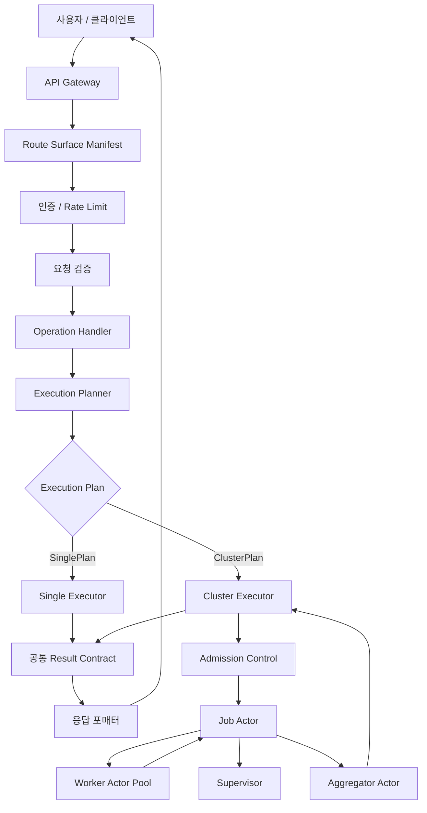
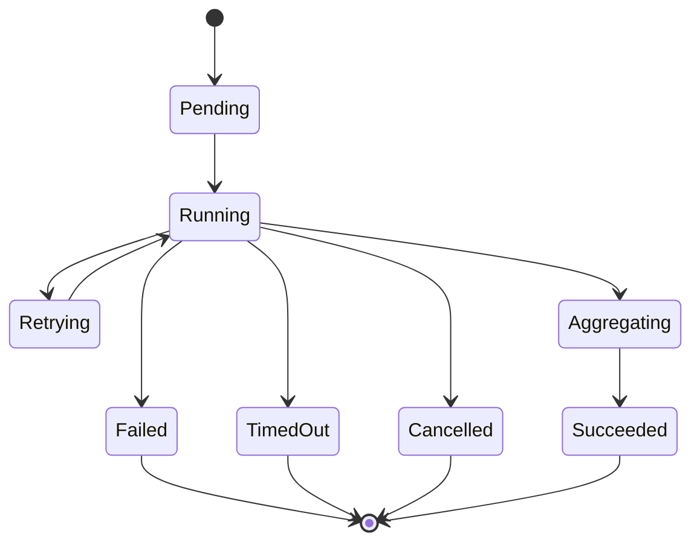

# Actor 기반 Single/Cluster 실행 전략 설계

## 목적

사용자 요청을 `single` 또는 `cluster` 경로로 처리하되, 두 경로가 서로
다른 product path로 갈라지지 않게 한다. 외부 contract는 하나로 유지하고,
성능과 실패 처리 특성이 다른 부분만 실행 전략으로 분리한다.

이 설계는 구현 직전 spec이다. 목표는 Go interface, package 경계,
migration 단계, 테스트 계획까지 결정해 다음 implementation plan이 바로
나올 수 있게 하는 것이다.

## 배경

최근 route surface refactor로 HTTP path는 `Route Surface Manifest`를 통해
S3, ops, admin, Iceberg, UI surface로 분류된다. route availability도
feature-backed route를 숨길지, 등록하되 unavailable 응답을 줄지 등록
시점에 결정한다.

actor pattern은 이미 일부 subsystem에서 사용된다. 예를 들어 receipt
tracking emitter는 actor goroutine이 session map을 단독 소유하고,
FinalizeSession은 actor에 질의해 순서를 보존한다. alerts state tracker도
actor goroutine 콜백 경계를 가진다.

이번 설계는 이 패턴을 모든 요청 path에 확대하지 않는다. actor는 상태가
오래 살고 실패 정책이 중요한 cluster 실행 내부에 집중 적용한다.

## 비목표

- 모든 HTTP 요청을 `RequestActor` mailbox로 통과시키지 않는다.
- route surface, auth, validation, response formatting을 actor화하지 않는다.
- 기존 S3 hot path를 actor hop으로 감싸지 않는다.
- 범용 durable job database schema를 이 spec에서 확정하지 않는다. 첫
  migration은 기존 operation-specific 상태 저장소를 사용한다.
- 기존 route surface manifest를 대체하지 않는다.

## 최종 접근

선택한 접근은 **공통 Operation + 실행 전략 분리**다.

요청은 route/auth/validation을 통과한 뒤 하나의 `Operation`으로 정규화된다.
`ExecutionPlanner`는 같은 operation에 대해 `SinglePlan` 또는
`ClusterPlan`을 선택한다. 이후 `SingleExecutor`와 `ClusterExecutor`가 같은
`Executor` contract를 구현한다.



## Component 설계

### Operation

`Operation`은 사용자-facing 의미를 담는 공통 명령이다. handler별 입력을
executor가 이해할 수 있는 형태로 정규화한다.

초기 적용 대상은 scrub 실행과 scrub job 조회 흐름이다. 이 경로는
long-running 성격이 있고, cluster-wide aggregation이 이미 도메인에 존재하며,
S3 object hot path보다 blast radius가 낮다. repair job과 대용량 batch성
작업은 scrub migration이 안정화된 뒤 같은 contract로 확장한다.

예상 형태:

```go
type Operation interface {
    Kind() OperationKind
    IdempotencyKey() string
    Deadline() time.Time
}
```

구체 타입은 operation별로 둔다.

```go
type ScrubOperation struct {
    Scope          ScrubScope
    CorrelationID  string
    RequestedAt    time.Time
    RequestDeadline time.Time
}
```

### ExecutionPlan

`ExecutionPlan`은 실행 전략과 실행 조건을 담는다.

```go
type ExecutionMode string

const (
    ExecutionSingle  ExecutionMode = "single"
    ExecutionCluster ExecutionMode = "cluster"
)

type ExecutionPlan struct {
    Mode           ExecutionMode
    Partitions     []Partition
    Deadline       time.Time
    IdempotencyKey string
    Async          bool
}
```

`SinglePlan`은 `Mode=single`, `Partitions`가 비어 있거나 1개다.
`ClusterPlan`은 partitioning, worker fan-out, async 여부를 포함한다.

### ExecutionPlanner

`ExecutionPlanner`는 operation과 runtime capability를 보고 plan을 만든다.
route/auth/validation 판단을 반복하지 않는다.

판단 기준:

- 작업 크기와 예상 latency
- cluster runtime 가용성
- fan-out 가능 여부
- deadline
- idempotency key 존재 여부
- admission control 이전의 coarse capacity signal

초기 정책은 보수적으로 둔다. cluster가 의미 있는 operation만
`ClusterPlan`을 만들고, 나머지는 `SinglePlan`을 만든다.

### Executor Contract

single과 cluster는 같은 contract를 구현한다.

```go
type Executor interface {
    Execute(ctx context.Context, op Operation, plan ExecutionPlan) (Result, error)
}
```

contract 요구사항:

- 같은 operation은 single/cluster에서 같은 외부 result schema를 반환한다.
- 같은 validation error, auth error, unsupported error model을 따른다.
- operation-level metrics, audit, receipt correlation 규칙을 공유한다.
- context cancellation을 존중한다.
- idempotency key가 있으면 중복 실행을 피하거나 같은 job/result로 수렴한다.

### SingleExecutor

`SingleExecutor`는 hot path를 보호한다. actor mailbox를 타지 않고 현재
runtime 함수 또는 service method를 직접 호출한다.

역할:

- 작은 동기 작업 실행
- cluster runtime이 없는 환경의 fallback
- contract test의 기준 구현

금지:

- 별도 result schema 정의
- cluster와 다른 validation 의미 부여
- actor hop 강제

### ClusterExecutor

`ClusterExecutor`는 actor 기반 orchestration을 담당한다.

역할:

- admission control
- idempotency lookup 또는 request digest 확인
- `JobActor` 생성 또는 기존 job 재사용
- async response 정책 적용
- final result 조회 또는 aggregate result 반환

긴 작업은 기본적으로 `202 Accepted + job_id`를 반환하고, status 조회로
이어진다. 짧고 bounded인 cluster 작업만 동기 aggregate response를 허용한다.

### JobActor

`JobActor`는 cluster job lifecycle의 단일 상태 소유자다.

상태:



책임:

- partition fan-out
- worker result fan-in
- job state transition
- timeout/cancel 처리
- supervisor에 retry decision 요청
- aggregation 시작 조건 판단

`JobActor` 내부 state와 operation-specific `Job State Store`는 전이 순서를
명확히 맞춘다. 첫 migration에서는 기존 scrub/session 상태 저장소를 adapter로
감싼다. 범용 durable job store가 필요해지는 시점에는 이 adapter contract를
기준으로 별도 role DB 또는 metadata DB 저장소를 추가한다.

### WorkerActor Pool

`WorkerActor`는 partition 또는 shard 하나를 처리한다. worker는 job마다
무한 생성하지 않고 bounded pool로 둔다.

정책:

- mailbox는 bounded
- worker retry는 partition 단위
- worker는 최종 job failure를 결정하지 않음
- 성공/실패는 `PartitionSucceeded` / `PartitionFailed` message로 보고

### Supervisor

`Supervisor`는 retry, backoff, cancellation, failure policy를 결정한다.

정책 예:

- retryable error면 partition 단위 retry
- deadline 초과면 job timeout
- admission capacity 초과면 job 시작 전 reject
- repeated worker failure면 job fail

retry storm을 막기 위해 exponential backoff와 max attempt를 둔다.

### AggregatorActor

`AggregatorActor`는 중간 결과를 최종 result contract로 병합한다.

초기 구현은 단일 aggregator로 충분하다. partition 수가 많아 fan-in 병목이
측정되면 tree aggregation 또는 streaming aggregation을 후속 최적화로 둔다.

## Package 배치

초기 package 배치는 기존 server/runtime 경계를 크게 흔들지 않는 쪽으로 둔다.

```text
internal/server/execution/
  operation.go
  planner.go
  executor.go
  result.go

internal/server/execution/single/
  executor.go

internal/server/execution/cluster/
  executor.go
  job_actor.go
  worker_pool.go
  supervisor.go
  aggregator.go
  metrics.go
```

operation이 server package 밖의 domain 타입을 필요로 하면 interface를 작게
유지하고 adapter를 둔다. cluster package에 HTTP 개념을 넣지 않는다.

## Error model

공통 error category:

- `ErrInvalidOperation`: validation 이후 operation construction에서 발견된
  의미 오류
- `ErrExecutionUnsupported`: 해당 operation이 선택된 executor에서 지원되지 않음
- `ErrAdmissionRejected`: capacity 또는 policy 때문에 cluster job 시작 거부
- `ErrJobTimedOut`: job deadline 초과
- `ErrJobCancelled`: caller 또는 system cancellation
- `ErrPartitionFailed`: retry 소진 후 partition 실패
- `ErrAggregationFailed`: 중간 결과 병합 실패

handler는 executor-specific error를 그대로 노출하지 않는다. response
formatter는 공통 category를 HTTP/S3/admin API surface에 맞는 응답으로
변환한다.

## 성능 정책

- `SingleExecutor`는 actor hop을 타지 않는다.
- `ClusterExecutor`만 bounded mailbox와 bounded worker pool을 가진다.
- admission control은 queue에 넣기 전에 실행한다.
- p50보다 p95/p99 latency를 주요 지표로 본다.
- actor mailbox depth, queue depth, worker utilization, retry count,
  timeout count를 측정한다.
- fan-in 병목이 확인되기 전에는 tree aggregation을 구현하지 않는다.

## 유지보수 정책

single/cluster 분기는 executor strategy에만 둔다.

공통 유지:

- route surface classification
- auth/authz
- request validation
- operation semantics
- result schema
- error category
- audit/receipt/metrics contract

분리 허용:

- execution planning
- worker fan-out
- retry/backoff
- aggregation
- queue/admission control
- async job state

## 테스트 계획

### Contract tests

같은 operation을 `SingleExecutor`와 `ClusterExecutor`에 실행해 외부 result가
같은지 검증한다.

검증 항목:

- success result schema
- validation 이후 unsupported error
- cancellation
- timeout
- idempotency duplicate request
- metrics/audit correlation ID

### Planner tests

- small operation은 `SinglePlan`
- fan-out 가능한 large operation은 `ClusterPlan`
- cluster runtime unavailable이면 `SinglePlan` 또는 unsupported
- missing idempotency key가 필요한 async job은 reject
- deadline이 너무 짧으면 cluster plan reject

### Actor tests

- `JobActor` state transition
- worker success fan-in
- worker failure retry
- retry exhaustion
- timeout
- cancellation
- mailbox full behavior
- actor shutdown without goroutine leak

### Integration tests

- representative admin long-running operation end-to-end
- `202 Accepted + job_id` status lookup
- duplicate idempotency key returns same job/result
- cluster unavailable path

### Performance tests

- single path latency before/after
- cluster job throughput
- p95/p99 job duration
- mailbox depth under load
- retry storm scenario

## Migration 단계

### Phase 1: Contract scaffolding

- `Operation`, `ExecutionPlan`, `Executor`, `Result` interface 추가
- no-op 또는 thin adapter `SingleExecutor` 추가
- 기존 handler behavior 변경 없음

### Phase 2: Scrub operation migration

- scrub trigger와 scrub job 조회를 첫 operation으로 선택
- handler에서 operation을 만들고 planner/executor를 호출
- single executor로 기존 behavior 유지

### Phase 3: Cluster executor actor path

- scrub operation에 `ClusterPlan` 지원
- `JobActor`, bounded worker pool, supervisor, aggregator 추가
- async response와 기존 scrub job status 조회 surface 연결

### Phase 4: Contract and perf hardening

- single/cluster contract tests를 공통 suite로 고정
- p95/p99 latency와 mailbox depth dashboard 추가
- retry/timeout runbook 작성

### Phase 5: Expand selectively

- long-running, retry-heavy, fan-out 가능한 operation만 추가 migration
- 단순 hot path는 유지

## 확정 결정

1. 첫 migration 대상은 scrub trigger와 scrub job 조회 흐름이다.
2. async job status는 새 generic job API를 만들지 않고 기존 scrub/admin/ops
   surface에 연결한다.
3. 첫 phase의 `Job State Store`는 기존 scrub/session 상태 저장소를 adapter로
   감싼다. 범용 durable job store는 두 번째 operation을 migration할 때
   필요성이 확인되면 별도 설계한다.

## 성공 기준

- single path p95 latency가 actor 도입 전 대비 의미 있게 악화되지 않는다.
- cluster job은 bounded worker pool과 admission control을 통해 부하를 제한한다.
- 같은 operation의 single/cluster 결과 contract가 contract test로 보장된다.
- job timeout, cancellation, retry exhaustion이 관측 가능하다.
- 신규 operation 추가 시 validation/result/error model을 중복 구현하지 않는다.
